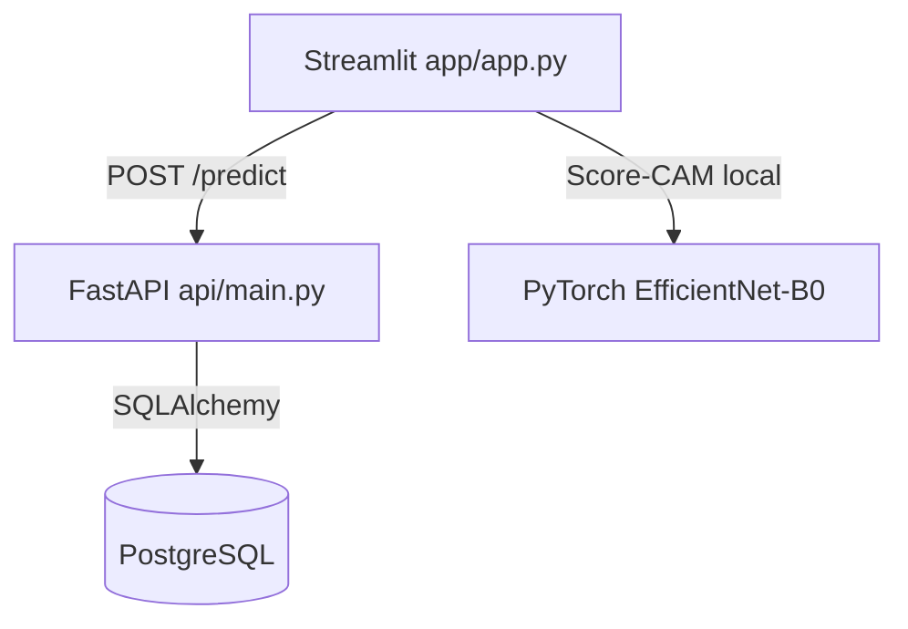

# 🔬 Clasificación Histopatológica de Cáncer Bucal (OSCC) con IA


> [!WARNING]
> **Aviso médico importante:** este repositorio es una **prueba de concepto académica** para investigación en patología digital. **No** es un dispositivo médico ni una herramienta de diagnóstico clínico, y no sustituye la evaluación de un profesional sanitario.

## 📌 Resumen

Este proyecto implementa un sistema de apoyo a clasificación histopatológica de imágenes H&E para distinguir entre:

- **Tejido epitelial normal**
- **OSCC (Oral Squamous Cell Carcinoma)**

El pipeline está desacoplado en tres capas:

1. **Frontend Streamlit** para interacción clínica/visual.
2. **API FastAPI** para inferencia y registro de predicciones.
3. **PostgreSQL** para auditoría técnica de resultados.

Además incorpora visualización **Score-CAM** para interpretabilidad en la interfaz.

---

## 🧠 Modelo y enfoque ML

- **Backbone:** EfficientNet-B0.
- **Cabeza personalizada:** `Linear(1280,256) + BatchNorm + ReLU + Dropout(0.3) + Linear(256,1)`.
- **Salida:** probabilidad binaria para clase OSCC mediante sigmoide.
- **Preprocesamiento de inferencia:** resize a `224x224` + normalización ImageNet.

---

## ⚙️ Arquitectura de sistema

### Flujo end-to-end

1. Usuario sube una imagen en Streamlit.
2. Si `API_URL` está definida, Streamlit envía la imagen a FastAPI.
3. FastAPI ejecuta inferencia con PyTorch.
4. FastAPI registra resultado en PostgreSQL (si disponible).
5. Streamlit muestra clase, confianza y mapa Score-CAM.



---

## 🗂️ Estructura real del repositorio

> Esta sección refleja los archivos/carpetas actualmente presentes y versionados para el proyecto.

```text
app_prediccion_cancer_bucal_histopatologico/
├── api/
│   ├── __init__.py
│   ├── database.py
│   ├── Dockerfile
│   ├── main.py
│   ├── model.py
│   ├── models_db.py
│   └── utils.py
├── app/
│   ├── app.py
│   ├── inference.py
│   ├── style.py
│   └── assets/
│       └── samples/
│           ├── Normal_100x_1.jpg
│           ├── Normal_100x_53.jpg
│           ├── Normal_400x_50.jpg
│           ├── OSCC_100x_142.jpg
│           └── OSCC_400x_109.jpg
├── k8s/
│   ├── api-deployment.yaml
│   ├── api-service.yaml
│   ├── postgres-deployment.yaml
│   ├── postgres-pvc.yaml
│   └── postgres-service.yaml
├── data/
│   ├── train/
│   ├── val/
│   └── test/
├── data_procesada/
│   ├── manifiesto.csv
│   ├── train/
│   ├── val/
│   └── test/
├── models/
│   ├── best_model_efficientnet_base.pth
│   ├── best_model_efficientnet_variante.pth
│   ├── best_model_resnet50_base.pth
│   ├── best_model_resnet50_variante.pth
│   ├── best_model_vgg16_base.pth
│   └── best_model_vgg16_variante.pth
├── notebooks/
│   ├── EDA.ipynb
│   ├── ENTRENAMIENTO.ipynb
│   └── PREPROCESAMIENTO.ipynb
├── results/
│   ├── comparacion_final.csv
│   ├── history_efficientnet_base.json
│   ├── history_efficientnet_variante.json
│   ├── history_resnet50_base.json
│   ├── history_resnet50_variante.json
│   ├── history_vgg16_base.json
│   ├── history_vgg16_variante.json
│   └── interpretabilidad/
│       └── diagnostico_final_scorecam.png
├── .env.example
├── .gitignore
├── docker-compose.yml
├── README.md
├── requirements-api.txt
└── requirements.txt
```

---

## 🚀 Formas de ejecución

### 1) Demo local (solo Streamlit, sin API)

```bash
python -m venv .venv
# Activar entorno virtual
pip install -r requirements.txt
streamlit run app/app.py
```

### 2) Streamlit + API local (sin Docker)

```bash
python -m venv .venv
# Activar entorno virtual
pip install -r requirements-api.txt
pip install -r requirements.txt

uvicorn api.main:app --host 0.0.0.0 --port 8000
```

En otra terminal (PowerShell):

```powershell
$env:API_URL="http://localhost:8000"
streamlit run app/app.py
```

### 3) Docker Compose (API + PostgreSQL)

```bash
docker compose up --build -d
docker compose ps
```

Luego ejecutar Streamlit (si no usas `.env`):

```powershell
$env:API_URL="http://localhost:8000"
streamlit run app/app.py
```

### 4) Kubernetes con Minikube (API + PostgreSQL)

```powershell
minikube start --memory=4096 --cpus=2
minikube docker-env | Invoke-Expression

kubectl apply -f k8s/postgres-pvc.yaml
kubectl apply -f k8s/postgres-deployment.yaml
kubectl apply -f k8s/postgres-service.yaml

docker build -t medical-api:v1 -f api/Dockerfile .
kubectl apply -f k8s/api-deployment.yaml
kubectl apply -f k8s/api-service.yaml

minikube service medical-api-service --url
```

---

## 🧪 Endpoints API

- `GET /health` → estado de servicio.
- `GET /model-info` → metadatos del modelo.
- `POST /predict` → inferencia desde archivo de imagen.

Ejemplo rápido:

```bash
curl http://localhost:8000/health
```

---

## 🧾 Dataset y referencia

- Dataset en Kaggle: [Histopathological Imaging Dataset for Oral Cancer](https://www.kaggle.com/datasets/ashenafifasilkebede/dataset/data)
- DOI: [10.17632/ftmp4cvtmb.1](https://doi.org/10.17632/ftmp4cvtmb.1)
- Título original: *A histopathological image repository of normal epithelium of Oral Cavity and Oral Squamous Cell Carcinoma*

---

## 📄 Licencia

Este proyecto se distribuye con fines académicos y de investigación. Si vas a publicarlo de forma abierta, añade una licencia explícita (por ejemplo MIT) en un archivo `LICENSE`.
