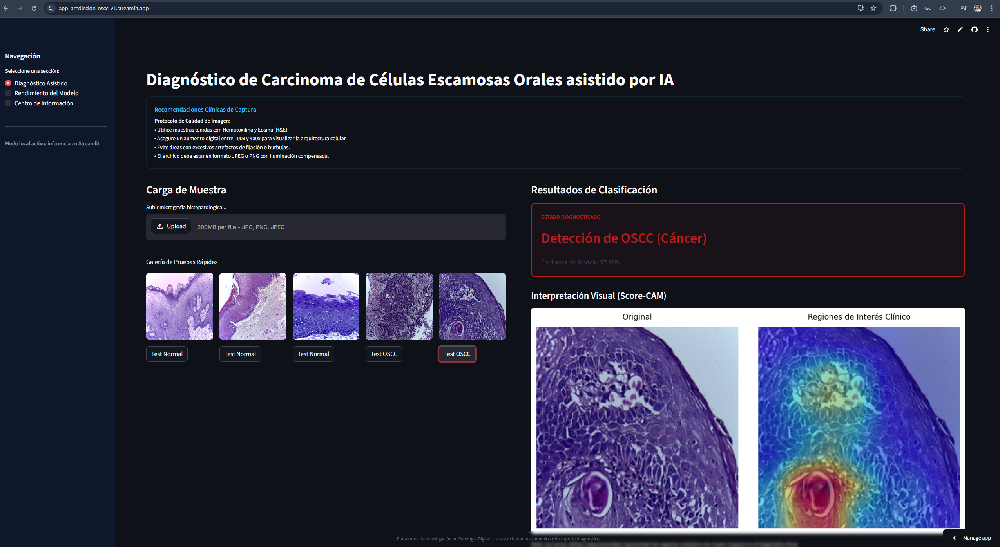
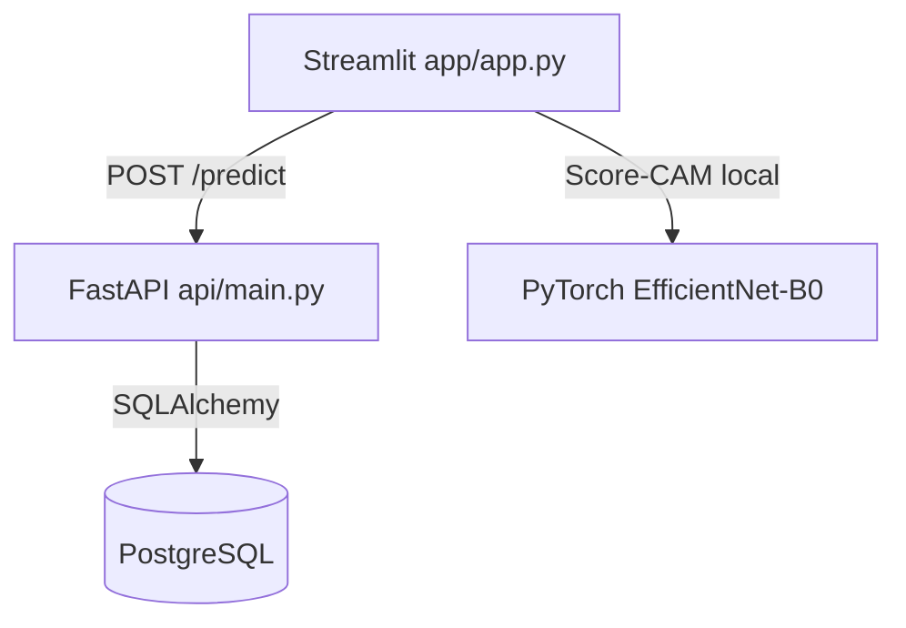

# 🔬 Clasificación Histopatológica de Cáncer Bucal (OSCC) con IA


> [!WARNING]
> **Aviso médico importante:** este repositorio es una **prueba de concepto académica** para investigación en patología digital. **No** es un dispositivo médico ni una herramienta de diagnóstico clínico, y no sustituye la evaluación de un profesional sanitario.

## 🌍 Demo en vivo

Prueba la aplicación publicada en Streamlit Cloud:

- [app-prediccion-oscc-v1.streamlit.app](https://app-prediccion-oscc-v1.streamlit.app/)

---

## 📌 Resumen

Este proyecto implementa un sistema de apoyo a clasificación histopatológica de imágenes H&E para distinguir entre:

- **Tejido epitelial normal**
- **OSCC (Oral Squamous Cell Carcinoma)**

El pipeline está desacoplado en tres capas:

1. **Frontend Streamlit** para interacción visual e interpretabilidad.
2. **API FastAPI** para servicio del modelo y trazabilidad de inferencias.
3. **PostgreSQL** para registro técnico/auditoría de predicciones.

Además, incorpora visualización **Score-CAM** para destacar regiones de interés morfológico.

---

## 🧠 Modelo y enfoque ML

- **Backbone principal:** EfficientNet-B0.
- **Cabeza personalizada:** `Linear(1280,256) + BatchNorm + ReLU + Dropout(0.3) + Linear(256,1)`.
- **Salida:** probabilidad binaria (OSCC vs Normal) con sigmoide.
- **Preprocesamiento de inferencia:** resize a `224x224` + normalización ImageNet.

---

## 📊 Métricas del modelo obtenido

Métricas extraídas de `results/comparacion_final.csv` sobre el conjunto de prueba.

### Modelo seleccionado para la app (EfficientNet variante)

| Métrica | Valor |
|---------|-------|
| Accuracy | **0.9731** |
| AUC-ROC | **0.9949** |
| F1-score | **0.9740** |
| Precision | **0.9776** |
| Recall | **0.9704** |
| Matriz de confusión | `[[244, 6], [8, 262]]` |

Esta configuración prioriza un buen equilibrio entre sensibilidad y precisión para soporte diagnóstico.

### Comparativa breve de arquitecturas

| Modelo | Accuracy | AUC | F1 |
|--------|----------|-----|----|
| EfficientNet variante | **0.9731** | 0.9949 | **0.9740** |
| ResNet50 variante | 0.9692 | **0.9973** | 0.9701 |
| ResNet50 base | 0.9635 | 0.9971 | 0.9642 |
| VGG16 variante | 0.9577 | 0.9946 | 0.9585 |
| VGG16 base | 0.9481 | 0.9915 | 0.9482 |
| EfficientNet base | 0.9404 | 0.9855 | 0.9407 |

---

## 🖼️ Capturas de la aplicación

### Vista principal (Diagnóstico)



### Vista de rendimiento del modelo


---

## ⚙️ Arquitectura de sistema

### Flujo end-to-end

1. Usuario carga una imagen histopatológica en Streamlit.
2. Si `API_URL` está definida, Streamlit envía el archivo a FastAPI.
3. FastAPI ejecuta inferencia con PyTorch.
4. FastAPI registra la predicción en PostgreSQL (si está disponible).
5. Streamlit presenta clase, confianza y mapa Score-CAM.



---

## 🗂️ Estructura del proyecto

```text
app_prediccion_cancer_bucal_histopatologico/
├── api/                                  # Backend de inferencia y registro
│   ├── __init__.py                       # Paquete Python del módulo API
│   ├── database.py                       # Configuración SQLAlchemy y sesión DB
│   ├── Dockerfile                        # Imagen Docker para FastAPI
│   ├── main.py                           # Endpoints (/health, /model-info, /predict)
│   ├── model.py                          # Carga de modelo y lógica de predicción
│   ├── models_db.py                      # Modelo ORM de tabla predictions
│   └── utils.py                          # Utilidades (carga/validación de imagen)
├── app/                                  # Frontend Streamlit
│   ├── app.py                            # Interfaz principal y flujo de inferencia
│   ├── inference.py                      # Predictor local + Score-CAM
│   ├── style.py                          # Estilos personalizados UI
│   └── assets/                           # Recursos visuales
│       ├── readme/                       # Imágenes embebidas en README
│       │   ├── Modelo.png                # Captura de la vista principal
│       │   └── Rendimiento modelo.png    # Captura de la vista de métricas
│       └── samples/                      # Imágenes de ejemplo para demo
│           ├── Normal_100x_1.jpg         # Caso normal (100x)
│           ├── Normal_100x_53.jpg        # Caso normal (100x)
│           ├── Normal_400x_50.jpg        # Caso normal (400x)
│           ├── OSCC_100x_142.jpg         # Caso OSCC (100x)
│           └── OSCC_400x_109.jpg         # Caso OSCC (400x)
├── k8s/                                  # Manifiestos Kubernetes (Minikube)
│   ├── api-deployment.yaml               # Deployment de FastAPI
│   ├── api-service.yaml                  # Service de FastAPI
│   ├── postgres-deployment.yaml          # Deployment de PostgreSQL
│   ├── postgres-pvc.yaml                 # Volumen persistente de PostgreSQL
│   └── postgres-service.yaml             # Service interno de PostgreSQL
├── data/                                 # Estructura de dataset bruto
│   ├── train/                            # Split de entrenamiento
│   ├── val/                              # Split de validación
│   └── test/                             # Split de prueba
├── data_procesada/                       # Dataset procesado para experimentos
│   ├── manifiesto.csv                    # Índice maestro de imágenes
│   ├── train/                            # Train procesado
│   ├── val/                              # Val procesado
│   └── test/                             # Test procesado
├── models/                               # Pesos entrenados (.pth)
│   ├── best_model_efficientnet_base.pth      # EfficientNet baseline
│   ├── best_model_efficientnet_variante.pth  # EfficientNet variante (modelo final)
│   ├── best_model_resnet50_base.pth          # ResNet50 baseline
│   ├── best_model_resnet50_variante.pth      # ResNet50 variante
│   ├── best_model_vgg16_base.pth             # VGG16 baseline
│   └── best_model_vgg16_variante.pth         # VGG16 variante
├── notebooks/                            # Cuadernos de investigación
│   ├── EDA.ipynb                         # Análisis exploratorio
│   ├── ENTRENAMIENTO.ipynb               # Entrenamiento/evaluación de modelos
│   └── PREPROCESAMIENTO.ipynb            # Pipeline de preprocesamiento
├── results/                              # Resultados experimentales
│   ├── comparacion_final.csv             # Tabla final de métricas por modelo
│   ├── history_efficientnet_base.json    # Curvas entrenamiento EfficientNet base
│   ├── history_efficientnet_variante.json # Curvas entrenamiento EfficientNet variante
│   ├── history_resnet50_base.json        # Curvas entrenamiento ResNet50 base
│   ├── history_resnet50_variante.json    # Curvas entrenamiento ResNet50 variante
│   ├── history_vgg16_base.json           # Curvas entrenamiento VGG16 base
│   ├── history_vgg16_variante.json       # Curvas entrenamiento VGG16 variante
│   └── interpretabilidad/                # Artefactos de explicabilidad
│       └── diagnostico_final_scorecam.png # Ejemplo visual de Score-CAM
├── .env.example                          # Plantilla de variables de entorno
├── .gitignore                            # Reglas de versionado
├── docker-compose.yml                    # Orquestación local API + PostgreSQL
├── README.md                             # Documentación principal del proyecto
├── requirements-api.txt                  # Dependencias para FastAPI/API
└── requirements.txt                      # Dependencias para Streamlit/demo
```

---

## 🚀 Formas de ejecución

### 1) Demo local (solo Streamlit, sin API)

```bash
python -m venv .venv
# Activar entorno virtual
pip install -r requirements.txt
streamlit run app/app.py
```

### 2) Streamlit + API local (sin Docker)

```bash
python -m venv .venv
# Activar entorno virtual
pip install -r requirements-api.txt
pip install -r requirements.txt

uvicorn api.main:app --host 0.0.0.0 --port 8000
```

En otra terminal (PowerShell):

```powershell
$env:API_URL="http://localhost:8000"
streamlit run app/app.py
```

### 3) Docker Compose (API + PostgreSQL)

```bash
docker compose up --build -d
docker compose ps
```

Luego ejecutar Streamlit (si no usas `.env`):

```powershell
$env:API_URL="http://localhost:8000"
streamlit run app/app.py
```

### 4) Kubernetes con Minikube (API + PostgreSQL)

```powershell
minikube start --memory=4096 --cpus=2
minikube docker-env | Invoke-Expression

kubectl apply -f k8s/postgres-pvc.yaml
kubectl apply -f k8s/postgres-deployment.yaml
kubectl apply -f k8s/postgres-service.yaml

docker build -t medical-api:v1 -f api/Dockerfile .
kubectl apply -f k8s/api-deployment.yaml
kubectl apply -f k8s/api-service.yaml

minikube service medical-api-service --url
```

---

## 🧪 Endpoints API

- `GET /health` → estado de servicio.
- `GET /model-info` → metadatos del modelo.
- `POST /predict` → inferencia desde archivo de imagen.

Ejemplo rápido:

```bash
curl http://localhost:8000/health
```

---

## ⚠️ Riesgos técnicos

- **Riesgo de generalización:** desempeño alto en dataset actual, pero posible caída ante variaciones de laboratorio, escáner o protocolo de tinción.
- **Shift de dominio:** diferencias de coloración H&E, iluminación o digitalización pueden alterar la distribución de entrada.
- **Sensibilidad a calidad de muestra:** artefactos histológicos (burbujas, desenfoque, pliegues) pueden degradar la precisión.
- **Interpretabilidad limitada:** Score-CAM ayuda visualmente, pero no constituye explicación causal ni validación clínica formal.
- **Dependencia de datos etiquetados:** el rendimiento depende de la consistencia y calidad del etiquetado experto.

---

## 🔮 Trabajo futuro

- **Validación externa multicéntrica** con hospitales/laboratorios distintos para medir robustez real.
- **Calibración de probabilidades** (Platt/Temperature Scaling) para una lectura de riesgo más confiable.
- **Mejoras de explicabilidad** combinando Score-CAM con métodos adicionales (Grad-CAM++, Integrated Gradients).
- **Versionado y trazabilidad MLOps** con registro de experimentos y drift monitoring en producción.
- **Extensión multimodal** (metadatos clínicos + imagen) para enriquecer el soporte diagnóstico.

---

## 🧾 Dataset y referencia

- Dataset en Kaggle: [Histopathological Imaging Dataset for Oral Cancer](https://www.kaggle.com/datasets/ashenafifasilkebede/dataset/data)
- DOI: [10.17632/ftmp4cvtmb.1](https://doi.org/10.17632/ftmp4cvtmb.1)
- Título original: *A histopathological image repository of normal epithelium of Oral Cavity and Oral Squamous Cell Carcinoma*

---

## 📄 Licencia

Este proyecto se distribuye con fines académicos y de investigación. Si vas a publicarlo de forma abierta, añade una licencia explícita (por ejemplo MIT) en un archivo `LICENSE`.
